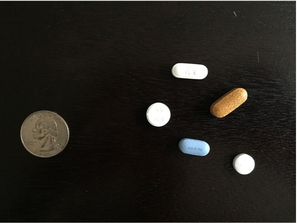
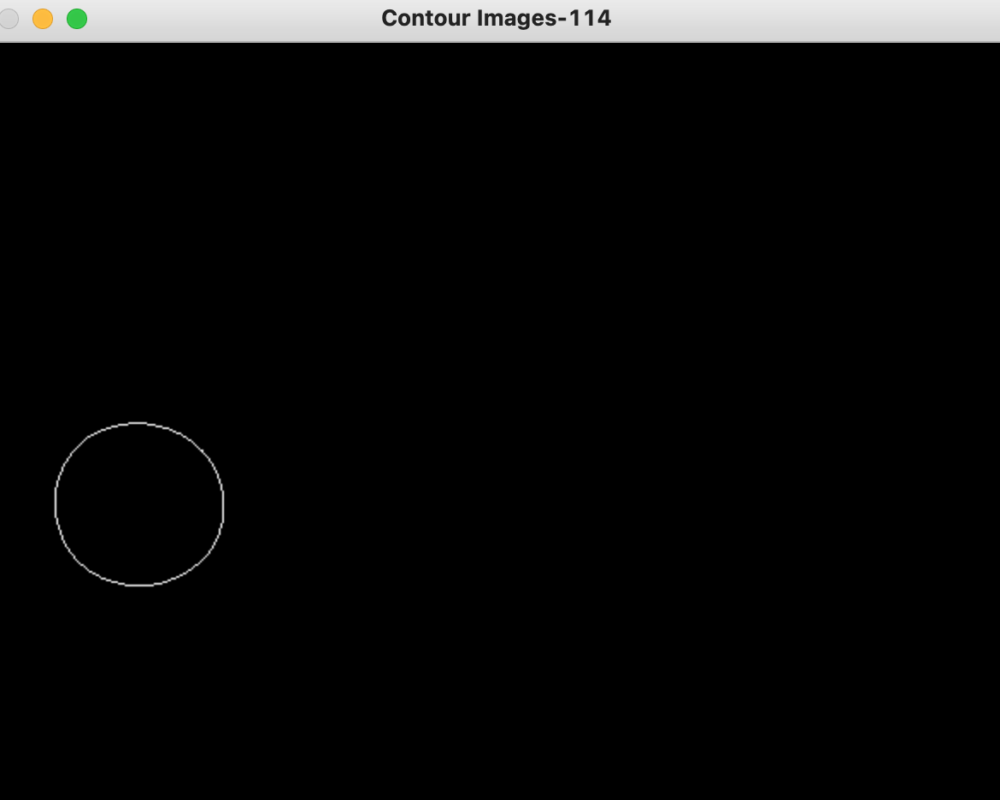
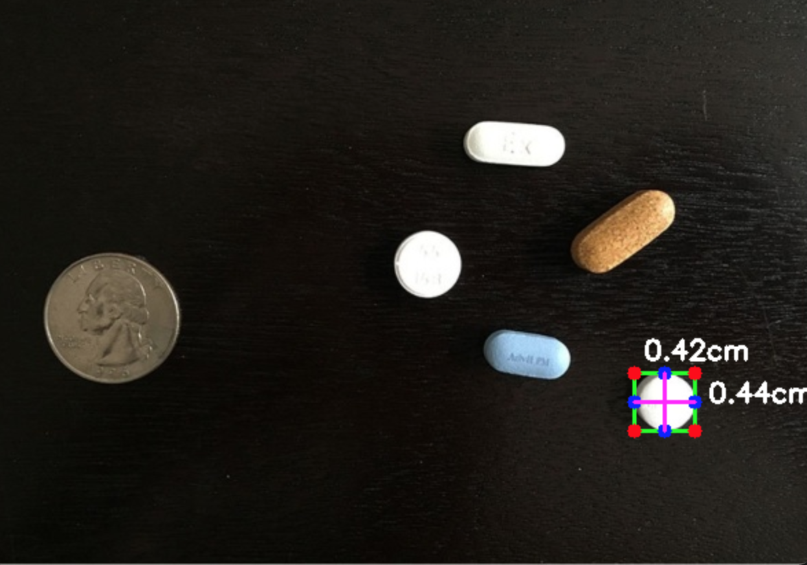

# Object Measurement

## Problem Statement
Given an image, and the dimension(height | width) of an object in the image, measure the dimesnsion of the remaining objects. The object whose dimenstion(s) are known will be our reference object.




## Methodology
After we guarantee the reference object, we try and find its contour index. To do this, first install the package using ```pip install ObjectMeasurement``` command on your terminal and follow the code below.

## Fetched Contour Index Image



The image title shows that, for the reference object, the contour-index is 114. 
This is displayed as one skims through the images after the ```contours()``` method is invoked.

You need to find this index and pass it as a parameter in ```calc_metrics_pixels()``` method.
The code for a test case is below.


```python 
from ObjectMeasurement import obj_measure, midpoint, order_points

# load the image
path = 'image/image.png'
image = obj_measure(path)

# draw contour for the outer-boundary if it is required
image.draw_contour()

# image processing - will help in contour detection
image.image_processing()

# fetch the contours
# jot down the index of the contour where you first see the contour of the reference object
contour = image.contours(min_contour_area=100)

# either the height or the width needs to be known
height = 0.955 # this was known before-hand
width = None

# calculate the pixel per metrics
contour_index = 114 # fetched from the image title
pixel_per_metric = image.calc_metrics_pixels(contour, contour_index, height=height, width=width)

# displays the measurements of the contours one-by-one
image.display_measurement(pixel_per_metric, contour, minarea=300)
```
## Understanding some of the parameters
```
min_contour_area : will discard the contour(will not be displayed) if the area of the contour is less than this number
minarea : will only measure the length and breadth of objects(identified by contours) that are greater than this number
```
# One of Output Images
